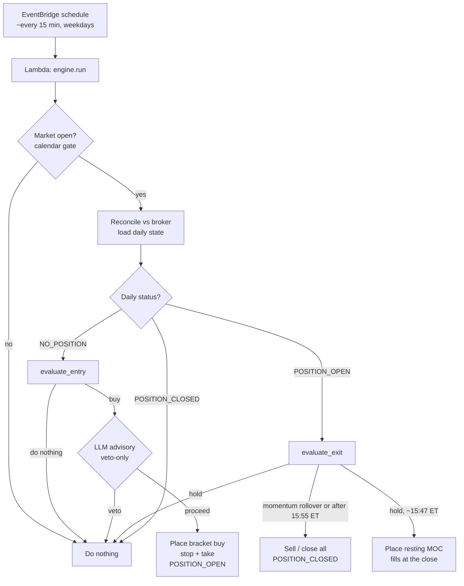

# Agentic-Stock-Trader

Intraday agentic QQQ/PSQ trading bot. Each morning it decides to **buy QQQ**,
**buy PSQ** (inverse), or **do nothing** — buy once, sell once, flat by close.

A deterministic, backtested `MomentumStrategy` makes the call; an LLM
(Tree-of-Thought) advisory pass may only **veto** a buy, never create one. It runs
as a scheduled AWS Lambda (EventBridge + DynamoDB + SSM), but the same engine runs
end-to-end on your laptop against the Alpaca paper endpoint.

The full design, rationale, and standing caveats live in **[DECISIONS.md](DECISIONS.md)** —
read it first; it is the source of truth for *why* things are shaped this way.

> **Not financial advice.** An automated bot trading real money carries real loss
> risk. Local/paper tests prove the system *works*, not that it makes money.

## How it works

A schedule (EventBridge) wakes a **stateless** Lambda ~every 15 min on weekdays.
Each run reads the day's state from DynamoDB, reconciles against the broker, and
decides — so "when to sell" is just a later run finding the position open and
choosing to exit. State persists between runs; nothing sits running in between.



The bracket stop/take also fills **autonomously on the broker** between runs; the
next run's reconcile then marks the position closed. See
[docs/operations.md](docs/operations.md) for the full trade lifecycle.

## Documentation

| Guide | What's in it |
|---|---|
| **[docs/running-locally.md](docs/running-locally.md)** | Setup, env vars, config, running against Alpaca paper, force-entry |
| **[docs/deployment.md](docs/deployment.md)** | CDK deploy (paper + live), SSM secrets, scheduling, EOD backstops, alarms |
| **[docs/operations.md](docs/operations.md)** | Inspecting runs & advisory decisions, the export scripts, data stores |
| **[docs/improvements.md](docs/improvements.md)** | Planned enhancements & known gaps |
| **[DECISIONS.md](DECISIONS.md)** | Design decisions and rationale |

`make help` lists the common dev/deploy tasks.

## Layout

```
src/trading_bot/
  domain/       # typed, pure data: MarketState, Decisions, StrategyConfig, Position
  indicators/   # code-computed signals from OHLCV (look-ahead safe)
  strategy/     # Strategy protocol + deterministic MomentumStrategy (v1)
  backtest/     # replay historical MarketState snapshots through a strategy
  broker/       # Broker protocol + FakeBroker (tests) + AlpacaBroker (paper/live)
  state/        # StateRepository protocol + InMemory/DynamoDB + reconcile rules
  reasoning/    # LangGraph: parallel gather -> MarketState, ToT advisory (veto-only)
  data/         # MarketDataProvider implementations (AlpacaMarketDataProvider)
  config_loader.py    # StrategyConfig resolver (file / SSM / defaults)
  market_calendar.py  # is-the-market-open gate (Static + Alpaca)
  engine.py     # TradingEngine: gate -> reconcile -> route -> decide -> veto -> write
  runner.py     # run_once + build_engine / build_local_engine factories
  aws/          # Lambda handler + SSM SecureString secrets loader
infra/          # CDK app: TradingBotStack (paper + live)
examples/       # runnable demos + the run/advisory export scripts
tests/          # unit tests (pure, no AWS / broker / network)
```

The strategy is a **pure function of `(MarketState, StrategyConfig)`** — no broker,
no AWS, no LLM. That contract keeps it unit-testable, backtestable, and swappable,
and lets the LLM layer only *veto* a buy, never create one.

## Quickstart

```bash
uv sync                                   # core deps + dev tools
uv run pytest                             # the test suite (pure, no network)
uv run python examples/run_backtest.py    # synthetic end-to-end demo
```

To run the real flow against Alpaca paper, see
**[docs/running-locally.md](docs/running-locally.md)**.
